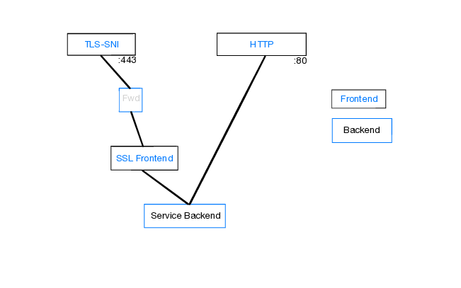

# HAProxy configuration

## TLS path
Incoming requests first hit a frontend (mode: tcp) that uses SNI to figure out which
host the request is for. Since we can't directly route to another frontend,
each request is then routed to a dummy backend that forwards the request
to the matching frontend. This frontend then decrypts SSL (mode: http), after which
the request is identical to an incoming HTTP request.
Using normal host matching, each request is then forwarded to a backend matching it's
Ingress.

## HTTP path
Since we don't have to decrypt anything, the HTTP path directly contains all backend
matching rules in it's frontend.
